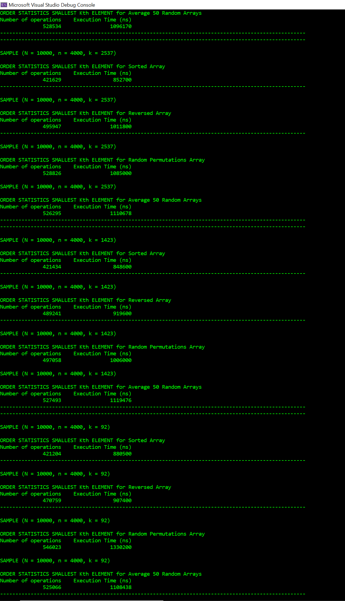
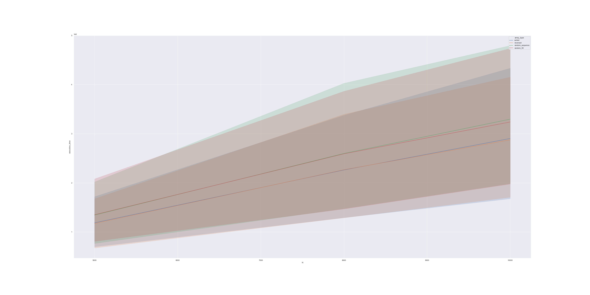
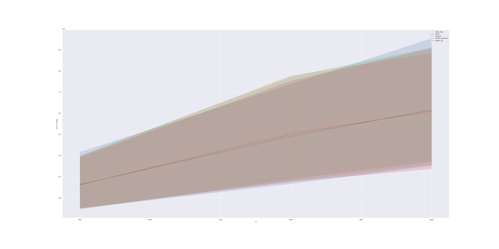

# Algorithms-Class--Median-Image-Filtering-and-Order-Statistic
A sample program that allows to perform a median filtering on noisy grayscale .pgm images and test the smallest Kth number Order Statistic algorithm

# Testing Algorithms - *Median Image Filtering & Find the Smallest Kth Element Order Statistic*

This program was written for **CSC 382 Algorithms** class at **College of Staten Island (CUNY)**

Created by: **Konstantin Novichenko**

## Overview - Order Statistic Select Algorithm

The program implements *Order Statistic Select Algorithm* by using median of the medians as a pivot in modified partition. The program checks the efficiency of the algorithm for arrays of size **N = 5000, 8000, 10000** for random K in range **1 <= K <= 100, 300, 500, 1000, 2000, 4000** for the following test cases:
* Sorted Array
* Reversed Array
* Random Permunation of 1 to N Array
* 50 Random Instances of 1 to N (calculates average)

Efficiency is measured by execution time and the number of steps it took to sort the array.
User see the results of the sorting in a table format. The program outputs the results in .CSV file which is used for the data analysis. The .CSV file is being processed in jupyter notebook python script using Pandas and Seaborn. You can check the python script [here](./Data/Data_Analysis.ipynb). Both Graphs clearly show that the algorithm runs in linear time:

## Sample Output

Table with results

## Graphs

* Sorted Array - Execution Time

* Sorted Array - Steps

## Overview - Median Image Filtering Algorithm
The program implements *Median Image Filtering Algorithm* by using median of the matrix of pixelsof size NxN defined by the user. Program traverses through each subwindow, finds the median value among all the pixels in the matrix, and sets the middle pixel to that value. This allows to clear any grayscaly image from the noise which could improve facial recognition algorithms. You can see the comparissons below:

## Comparissons

* Before

* After (Window Size 5x5)

* Before

* After (Window Size 4x4)

* Before

* After (Window Size 4x4)

## Author

2020, Konstantin Novichenko
